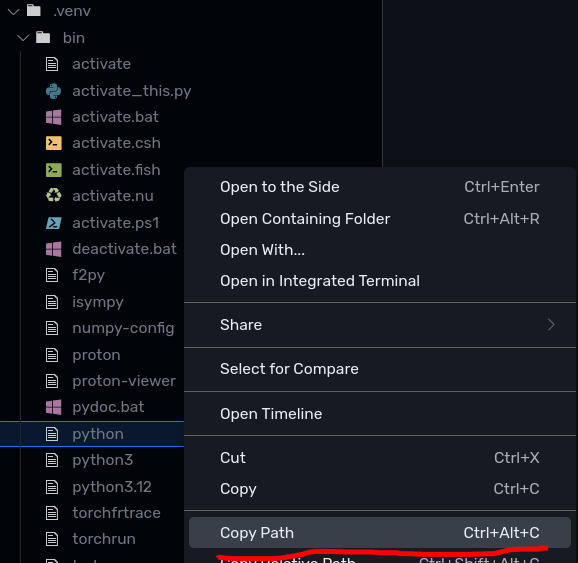
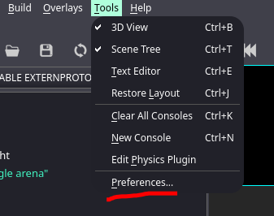
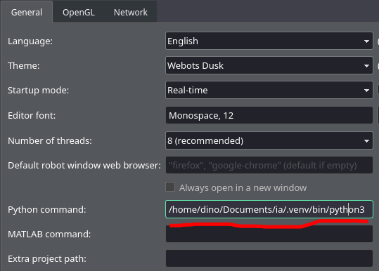
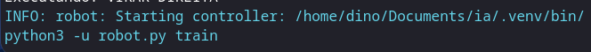

This guide will help you set up your Python environment and configure Webots to run your project.

## 1. Environment Setup

Navigate to the root directory of your Git repository in your terminal and execute the following commands:

```bash
pip install uv
uv venv
source .venv/bin/activate
uv sync
```

## 2. Webots Configuration

1. **Locate your Virtual Environment's Python Executable:**
   After activating your virtual environment (`source .venv/bin/activate`), you can find the absolute path to its Python executable by running:
   ```bash
   which python
   ```
   Copy this path. It will look something like `/path/to/your/repo/.venv/bin/python`.
   


2. **Open Webots Preferences:**
   In Webots, go to `Tools > Preferences`.


3. **Paste the Python Path:**
   In the Preferences window, find the `Python Command:` field and paste the absolute path you copied in step 1.


## 3. Running the Controller

Once your environment is set up and Webots is configured, you can run your robot's controller within Webots.
