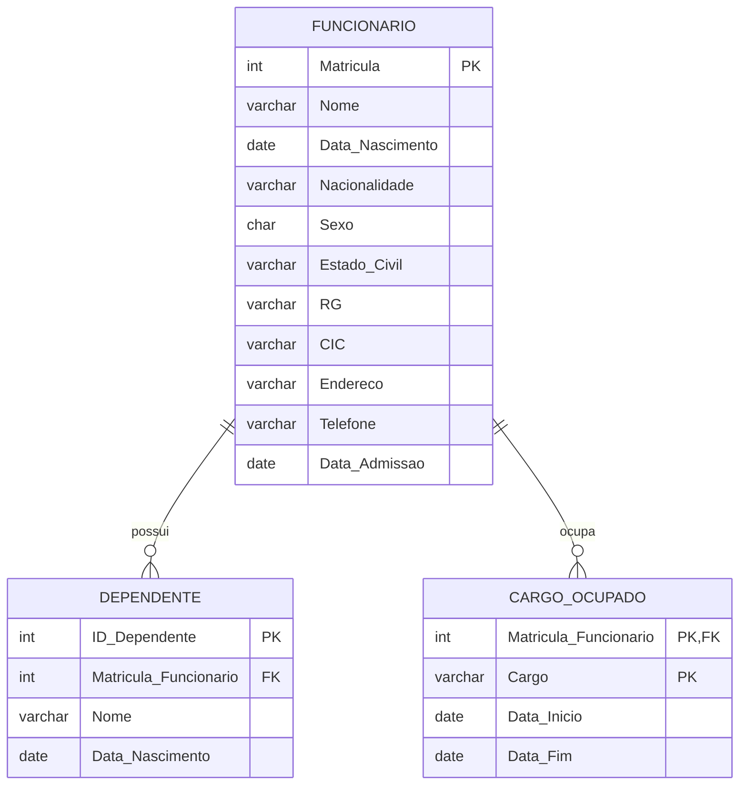
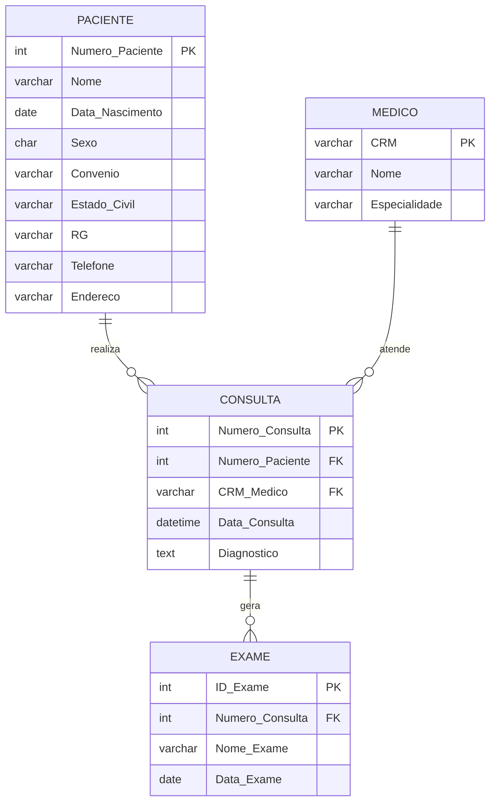
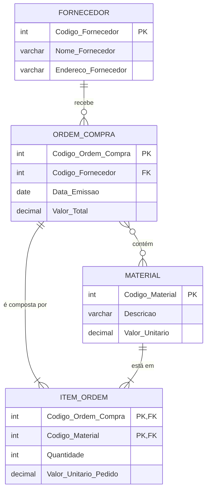

# Resolução da Lista de Exercícios de Normalização (com Diagramas)

Este documento apresenta a resolução dos exercícios de normalização de dados, aplicando as três primeiras formas normais (1FN, 2FN e 3FN) e incluindo um Diagrama de Entidade-Relacionamento (DER) para cada cenário.

## Exercício 1: Cadastro de Funcionários

O objetivo é normalizar uma tabela para armazenar dados cadastrais de funcionários, considerando que um funcionário pode ter múltiplos cargos e dependentes.

### Estrutura Final (3FN)

**Tabela: FUNCIONARIO**

| Coluna          | Tipo de Dado | Chave | Descrição                                  |
| :-------------- | :----------- | :---- | :----------------------------------------- |
| Matricula       | INT          | PK    | Identificador único do funcionário.        |
| Nome            | VARCHAR      |       | Nome completo do funcionário.              |
| Data_Nascimento | DATE         |       | Data de nascimento.                        |
| Nacionalidade   | VARCHAR      |       | Nacionalidade do funcionário.              |
| Sexo            | CHAR(1)      |       | Sexo (M/F).                                |
| Estado_Civil    | VARCHAR      |       | Estado civil.                              |
| RG              | VARCHAR      |       | Número do RG.                              |
| CIC             | VARCHAR      |       | Número do CIC (CPF).                       |
| Endereco        | VARCHAR      |       | Endereço completo.                         |
| Telefone        | VARCHAR      |       | Número de telefone.                        |
| Data_Admissao   | DATE         |       | Data de admissão na empresa.               |

**Tabela: CARGO_OCUPADO**

| Coluna                | Tipo de Dado | Chave | Descrição                                  |
| :-------------------- | :----------- | :---- | :----------------------------------------- |
| Matricula_Funcionario | INT          | PK, FK | Chave estrangeira para FUNCIONARIO.        |
| Cargo                 | VARCHAR      | PK    | Nome do cargo ocupado.                     |
| Data_Inicio           | DATE         |       | Data de início no cargo.                   |
| Data_Fim              | DATE         |       | Data de término no cargo (pode ser nulo). |

**Tabela: DEPENDENTE**

| Coluna                | Tipo de Dado | Chave | Descrição                                  |
| :-------------------- | :----------- | :---- | :----------------------------------------- |
| ID_Dependente         | INT          | PK    | Identificador único do dependente.        |
| Matricula_Funcionario | INT          | FK    | Chave estrangeira para FUNCIONARIO.        |
| Nome                  | VARCHAR      |       | Nome completo do dependente.              |
| Data_Nascimento       | DATE         |       | Data de nascimento do dependente.          |

### Diagrama de Entidade-Relacionamento (DER)



## Exercício 2: Ficha Médica de Pacientes

O objetivo é normalizar os dados das fichas médicas de uma clínica.

### Estrutura Final (3FN)

**Tabela: PACIENTE**

| Coluna          | Tipo de Dado | Chave | Descrição                                  |
| :-------------- | :----------- | :---- | :----------------------------------------- |
| Numero_Paciente | INT          | PK    | Identificador único do paciente.        |
| Nome            | VARCHAR      |       | Nome completo do paciente.              |
| Data_Nascimento | DATE         |       | Data de nascimento.                        |
| Sexo            | CHAR(1)      |       | Sexo (M/F).                                |
| Convenio        | VARCHAR      |       | Plano de saúde do paciente.              |
| Estado_Civil    | VARCHAR      |       | Estado civil.                              |
| RG              | VARCHAR      |       | Número do RG.                              |
| Telefone        | VARCHAR      |       | Número de telefone.                        |
| Endereco        | VARCHAR      |       | Endereço completo.                         |

**Tabela: MEDICO**

| Coluna         | Tipo de Dado | Chave | Descrição                               |
| :------------- | :----------- | :---- | :-------------------------------------- |
| CRM            | VARCHAR      | PK    | Identificador único do médico.         |
| Nome           | VARCHAR      |       | Nome completo do médico.               |
| Especialidade  | VARCHAR      |       | Especialidade do médico.              |

**Tabela: CONSULTA**

| Coluna           | Tipo de Dado | Chave | Descrição                                  |
| :--------------- | :----------- | :---- | :----------------------------------------- |
| Numero_Consulta  | INT          | PK    | Identificador único da consulta.        |
| Numero_Paciente  | INT          | FK    | Chave estrangeira para PACIENTE.        |
| CRM_Medico       | VARCHAR      | FK    | Chave estrangeira para MEDICO.           |
| Data_Consulta    | DATETIME     |       | Data e hora da consulta.                   |
| Diagnostico      | TEXT         |       | Diagnóstico fornecido pelo médico.        |

**Tabela: EXAME**

| Coluna           | Tipo de Dado | Chave | Descrição                                  |
| :--------------- | :----------- | :---- | :----------------------------------------- |
| ID_Exame         | INT          | PK    | Identificador único do exame.             |
| Numero_Consulta  | INT          | FK    | Chave estrangeira para CONSULTA.          |
| Nome_Exame       | VARCHAR      |       | Nome ou tipo do exame realizado.          |
| Data_Exame       | DATE         |       | Data em que o exame foi realizado.         |

### Diagrama de Entidade-Relacionamento (DER)



## Exercício 3: Ordem de Compra

O objetivo é normalizar os dados de ordens de compra de materiais.

### Estrutura Final (3FN)

**Tabela: FORNECEDOR**

| Coluna                | Tipo de Dado | Chave | Descrição                                  |
| :-------------------- | :----------- | :---- | :----------------------------------------- |
| Codigo_Fornecedor     | INT          | PK    | Identificador único do fornecedor.        |
| Nome_Fornecedor       | VARCHAR      |       | Nome do fornecedor.                       |
| Endereco_Fornecedor   | VARCHAR      |       | Endereço do fornecedor.                   |

**Tabela: ORDEM_COMPRA**

| Coluna                | Tipo de Dado | Chave | Descrição                                  |
| :-------------------- | :----------- | :---- | :----------------------------------------- |
| Codigo_Ordem_Compra   | INT          | PK    | Identificador único da ordem de compra.   |
| Codigo_Fornecedor     | INT          | FK    | Chave estrangeira para FORNECEDOR.        |
| Data_Emissao          | DATE         |       | Data de emissão do pedido.                   |
| Valor_Total           | DECIMAL      |       | Valor total da ordem de compra.           |

**Tabela: MATERIAL**

| Coluna            | Tipo de Dado | Chave | Descrição                                  |
| :---------------- | :----------- | :---- | :----------------------------------------- |
| Codigo_Material   | INT          | PK    | Identificador único do material.          |
| Descricao         | VARCHAR      |       | Descrição do material.                    |
| Valor_Unitario    | DECIMAL      |       | Valor unitário atual do material.         |

**Tabela: ITEM_ORDEM**

| Coluna                  | Tipo de Dado | Chave | Descrição                                  |
| :---------------------- | :----------- | :---- | :----------------------------------------- |
| Codigo_Ordem_Compra     | INT          | PK, FK | Chave estrangeira para ORDEM_COMPRA.      |
| Codigo_Material         | INT          | PK, FK | Chave estrangeira para MATERIAL.          |
| Quantidade              | INT          |       | Quantidade do material no pedido.         |
| Valor_Unitario_Pedido   | DECIMAL      |       | Valor unitário no momento da compra.      |

### Diagrama de Entidade-Relacionamento (DER)



## Exercício 4: Projetos de Software

O objetivo é normalizar os dados de projetos e os empregados alocados a eles.

### Estrutura Final (3FN)

**Tabela: DEPARTAMENTO**

| Coluna                | Tipo de Dado | Chave | Descrição                                  |
| :-------------------- | :----------- | :---- | :----------------------------------------- |
| Codigo_Departamento   | INT          | PK    | Identificador único do departamento.        |
| Nome_Departamento     | VARCHAR      |       | Nome do departamento.                       |

**Tabela: EMPREGADO**

| Coluna                | Tipo de Dado | Chave | Descrição                                  |
| :-------------------- | :----------- | :---- | :----------------------------------------- |
| Codigo_Empregado      | INT          | PK    | Identificador único do empregado.          |
| Nome_Empregado        | VARCHAR      |       | Nome do empregado.                        |

**Tabela: PROJETO**

| Coluna                | Tipo de Dado | Chave | Descrição                                  |
| :-------------------- | :----------- | :---- | :----------------------------------------- |
| Codigo_Projeto        | INT          | PK    | Identificador único do projeto.           |
| Nome_Projeto          | VARCHAR      |       | Nome do projeto.                          |
| Data_Inicio           | DATE         |       | Data de início do projeto.                  |
| Data_Fim              | DATE         |       | Data de término do projeto.                 |
| Codigo_Departamento   | INT          | FK    | Chave estrangeira para DEPARTAMENTO.        |
| Codigo_Gerente        | INT          | FK    | Chave estrangeira para EMPREGADO.           |

**Tabela: ALOCACAO_PROJETO**

| Coluna                | Tipo de Dado | Chave | Descrição                                  |
| :-------------------- | :----------- | :---- | :----------------------------------------- |
| Codigo_Projeto        | INT          | PK, FK | Chave estrangeira para PROJETO.           |
| Codigo_Empregado      | INT          | PK, FK | Chave estrangeira para EMPREGADO.          |
| Horas_Trabalhadas     | INT          |       | Total de horas trabalhadas no projeto.      |

### Diagrama de Entidade-Relacionamento (DER)

```mermaid
erDiagram
    DEPARTAMENTO ||--o{ PROJETO : "contém"
    EMPREGADO ||--o{ PROJETO : "gerencia"
    PROJETO }o--o{ EMPREGADO : "aloca"

    DEPARTAMENTO {
        int Codigo_Departamento PK
        varchar Nome_Departamento
    }

    EMPREGADO {
        int Codigo_Empregado PK
        varchar Nome_Empregado
    }

    PROJETO {
        int Codigo_Projeto PK
        varchar Nome_Projeto
        date Data_Inicio
        date Data_Fim
        int Codigo_Departamento FK
        int Codigo_Gerente FK
    }

    ALOCACAO_PROJETO {
        int Codigo_Projeto PK, FK
        int Codigo_Empregado PK, FK
        int Horas_Trabalhadas
    }

    PROJETO ||--|{ ALOCACAO_PROJETO : "tem"
    EMPREGADO ||--|{ ALOCACAO_PROJETO : "participa de"
